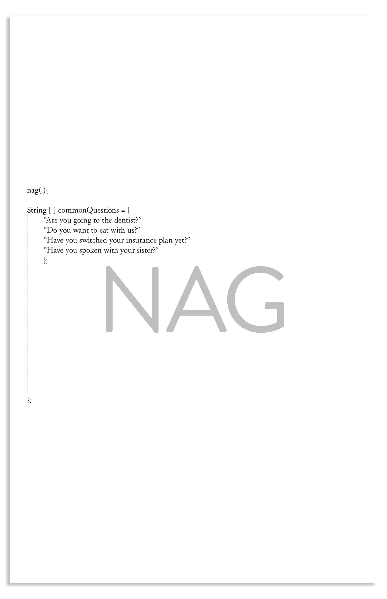
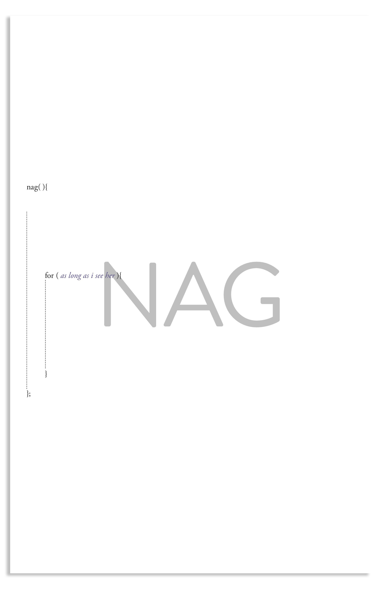

# Nag
##instructions on how to nag

### I know someone who worries too much.

1. Asking an array of questions which one is most concerned or anxious over.

2. You are in a fairly good relationship with the other person. 

3. And that person is still alive.

4. That other person will continuely ask the same series of question. 

5. Whether I answer yes or no, that other person will always ask the same series of questions repeatedly. 

